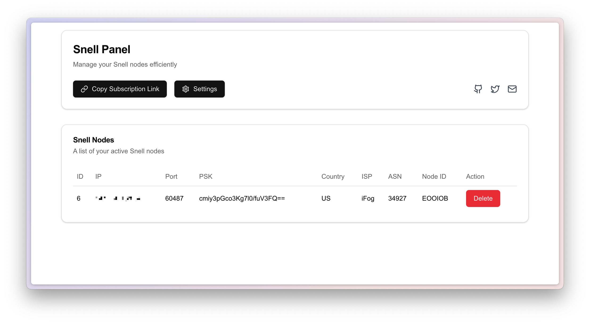

# Snell Panel for Surge

## Overview

This project provides unified management of Snell Nodes, automatically generating subscription links for users. The panel's web interface can be accessed via [snell-panel.owo.nz](http://snell-panel.owo.nz). You only need to enter your server’s API URL and token to start using it. 

## Features

- Unified management of multiple Snell nodes
- Automatic subscription link generation
- Simple web interface for easy management

## How to Use

1. **Start the Snell Panel server**

   Run the following command to start the server:

   ```bash
   ./snell-panel -token=your_token
   ```

2. **Install Snell Server**

   Use the following command to **install** Snell Server:

   ```bash
   bash <(curl -Ls https://ssa.sx/sn) install your_panel_url your_token custom_node_name
   ```

   Use the following command to **uninstall** Snell Server:

   ```bash
   bash <(curl -Ls https://ssa.sx/sn) uninstall your_panel_url your_token custom_node_name
   ```

   `custom_node_name` is optional. If your node name contains spaces, please use quotes. For example:

   ```bash
   bash <(curl -Ls https://ssa.sx/sn) install your_panel_url your_token "My Node Name"
   ```

3. **Access the Web UI**

   Access the management Web UI using the following link:

   [https://snell-panel.owo.nz](https://snell-panel.owo.nz)

   

   You can get the subscription link from the Web UI.

## TODO

- [x] Web UI implemented
- [ ] Node survival detection

## Web UI Source Code

**We are not considering open-sourcing any code for the Web UI at this time.**

## License

This project is licensed under GPL-3.0.